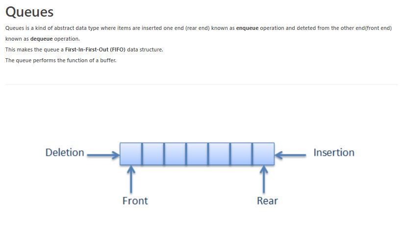

# QUEUE-ES6
  Queues are just arrays with two primary operations: 
  * unshift and pop. 
    * Unshift **enqueues** items to the end of the array, 
    * Pop **dequeues** them from the beginning of the array. 

In other words, Queues follow the “First In, First Out” protocol (FIFO). 

If the direction is reversed, we can replace unshift and pop with push and shift, respectively.

